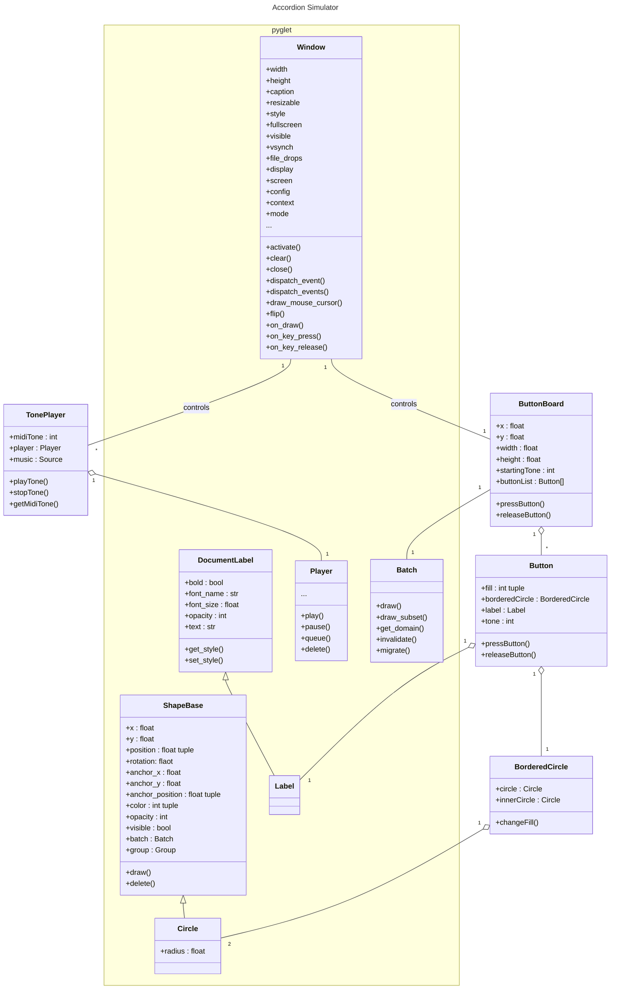

# Music Suite

## Process documentation

### Setting up the environment

In the task it is recommended to use Python as a programming language since it is important for the data scientists. Since I'm most fluently with R and JS right now I try to bridge Python code (to learn something new) with JS to use my skills in GUI design.

Pyglet seems to be a proper framework to catch multiple key presses and play multiple sounds at once so it might be useful for the live music app part of this project. But can it be integrated in the browsers view port? I will try Pyodide for this.

It might be better to not use a JS-Python bridge for easyness. Maybe this is just a architectural burden. The data processing and visualisation part might be low in this project and so Python benefits might be not used at all.

```plantuml
left to right direction
skinparam packageStyle rectangle
actor user
actor student
actor "music teacher" as teacher
actor manager
actor developer
actor support
user <|-- teacher
user <|-- student
rectangle "Music Learning Suite" as MLS {
  together {
    user --> (analyse music)
    user --> (compose music)
    student --> (learn music theory)
    user --> (rent a midi instrument)
    user --> (share compositions)
    student --> (book lessons)
    user --> (practice)
    user --> (play music together)
    teacher --> (billing)
    teacher --> (offer lessons)
    teacher --> (create learning content)
  }

  together {
    (accessing learning\npath information) <-- developer
    (add new instrument) <-- developer
    (managing user information) <-- support
    (seeing buisness stats) <-- manager
  }

  (analyse music) -[hidden]- (add new instrument)
}
```

```plantuml
database "MySQL" {
    [user data]
    [course data]
    [lessons]
}

component "Music Suite" {
    [Music Analyser]
    [Instrument Simulator]
}

[Accountmanagement] --> [user data]
[Authentification] --> [user data]
[Authentification] -- [Dashboard GUI]
[Lesson Booking] -- [Dashboard GUI]
[Learning Package] -- [Dashboard GUI]
[Learning Package] --> [course data]
[Learning Package] -- [lessons]
[Buisness Inteligence] -- [Dashboard GUI]
[Accountmanagement] -- [Dashboard GUI]
[Database Manager] -- [Dashboard GUI]
[Accounting] -- [Dashboard GUI]

[Music Suite] -- [Dashboard GUI]
```

