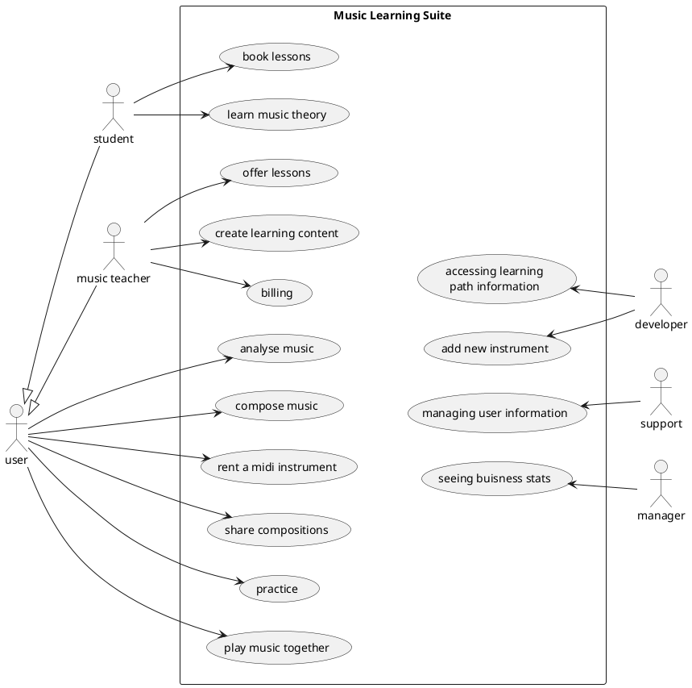
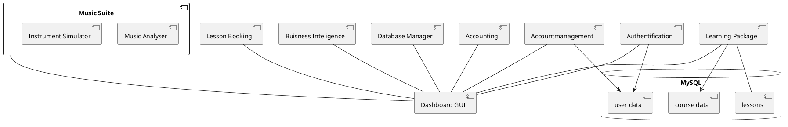
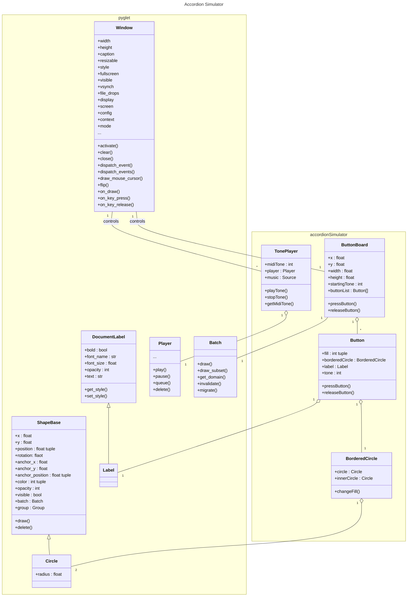

# Music Suite

## Pet project

### Setting up the environment

In the task it is recommended to use Python as a programming language since it is important for the data scientists. Since I'm most fluently with R and JS right now I try to bridge Python code (to learn something new) with JS to use my skills in GUI design.

Pyglet seems to be a proper framework to catch multiple key presses and play multiple sounds at once so it might be useful for the live music app part of this project. But can it be integrated in the browsers view port? I will try Pyodide for this.

It might be better to not use a JS-Python bridge for easyness. Maybe this is just a architectural burden. The data processing and visualisation part might be low in this project and so Python benefits might be not used at all.

In the end I decided to go with the pyglet framework for the accordion simulator and don't use Pyodide for building the online dashboard structure because the accordion simulator might become handy for my hobby.

### Accordion Simulator

Right now you can press buttons on your computer keyboard which are mapped to the buttons of an button accordion with b-grip. The correct tone - sampled from a VST instrument - will get played while a button is pressed.

Things to add:

* display which notes are played on the staff
* show how the accord is named that is played when pressing multiple buttons
* import a music sheet and 
    * play it
    * color the button that should be pressed right now (help to learning play)

It would be aesome if there could be something like in Guitar Hero where notes move toward a play area and have to be pressed at the right time.

## The big idea

### UML diagrams

This use case diagram shows the whole music suite. The accordion simulator should be one of many simulators and should be used to

* practice
* play music together
* compose music
* analyse music

Beside the simulator a LMS would be handy to organize learning material by music teachers. Also a backend dashboard for accounting, business insights etc. is needed. Everything might be accessed by a unified dashboard where you have to log in first before accessing the services your role grants you access to or start a instrument simulator. A first draft is shown in this component diagram:

In the class diagram you find the classes of the accordion simulator and the used classes from pyglet and their depenencies:

