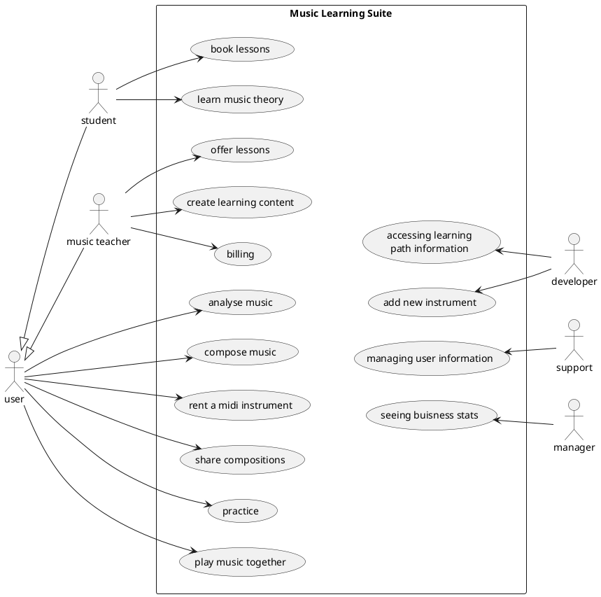
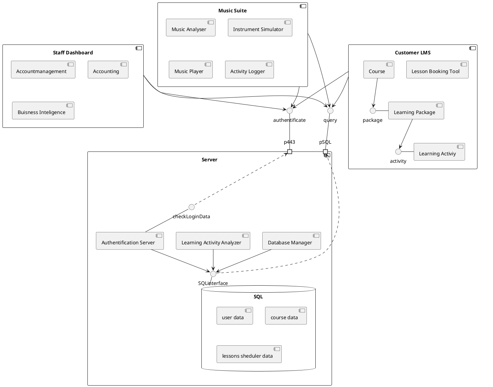
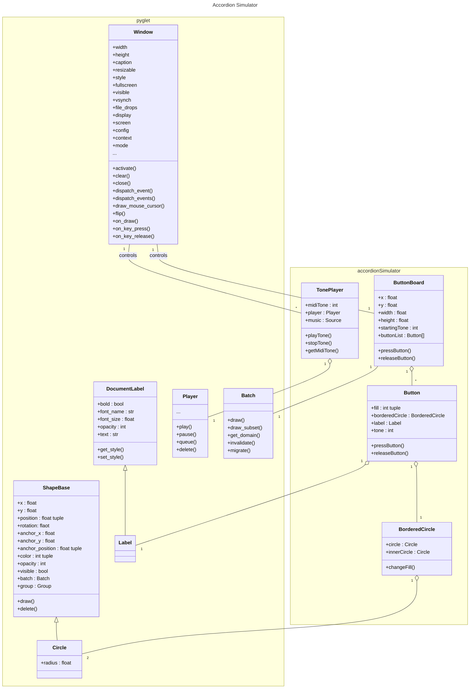
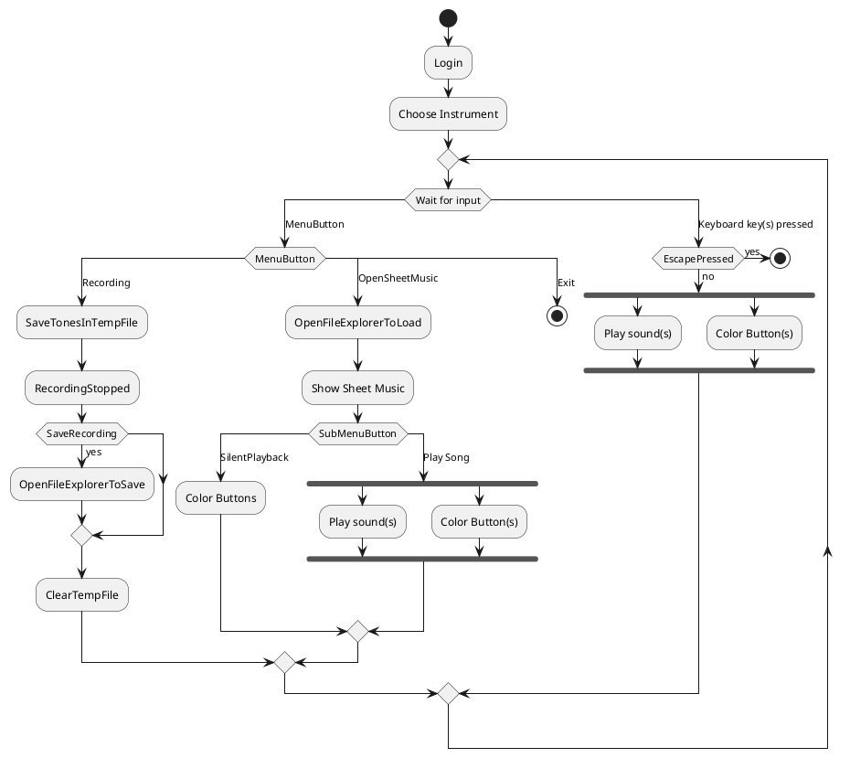

# Music Suite

Please read my report in the [HTML version](https://raw.githubusercontent.com/Famondir/Music-Suite/main/README.html) (right click --> save link as) so all images are included in the the right place.

## Links to the sections to assess

1. [Git](#git)
2. [UML](#uml-diagrams)
3. [DDD](#ddd)
4. [Metrics](#metrics)
5. [Clean Code Developement](#clean-code-developement)
6. [Build](#build)
7. [Continuous Delivery](#continuous-delivery)
8. [Unit tests](#unit-tests)
9. [IDE](#visual-studio-code)
10. [DSL](#dsl)
11. [Functional Programming](#functinal-programming)

## Todo-List

1. add a red thread

## Pet project

### Setting up the environment and programming language choice

In the task it was recommended to use Python as a programming language since it is important for data scientists. Since I'm most fluent with R and JS I decided (at the beginning of the project) trying to bridge Python code (to learn something new) with JS to use my skills in GUI/dashboard design.

**Pyglet** seemed to be a proper framework to catch multiple key presses and play multiple sounds at once. Thus it was a candidate for the live music app part of this project and it turned out that it is realy a sufficient framework. But the objective to integrate it in the browsers view port (e.g. via **Pyodide**) was not met. Thus, I decided not to use a JS-Python bridge because it felt more and more like becoming an architectural burden. In the end I decided to go with the **pyglet** framework for the accordion simulator and not to code an additional online dashboard structure because the accordion simulator might become handy for my hobby. The web app part is left for the imaginary tasks on [UML](#uml-diagrams) and [DDD](#ddd).

The data processing and data visualisation tasks in the imlemented software is quite low. Thus data science related Python benefits (from libraries like pandas and numpy) have not been used a lot. It was mainly used for the [DSL](#dsl) task. But since Python is a very flexible language with a large variety of libraries it was a good choice anyhow. Achiving the same with Java or C++ would probably have brought greater obstacles.

For the tasks about [Build](#build) and [Continuous Delivery](#continuous-delivery) writing in C or C++ might have been interesting. But I have super low experiecne with those two languages. Java would be good there too. But to be honest I like that Python, R and JS are not so strict about types. Furthermore, it turned out that there is enough one can do regarding those two topics beside compiling the source code. Thus I don't regret picking Python as the language for this project.

I have to admit that I haven't worked on realy big projects and most of the time without object orientation. In the *Programmierung II* module from *Medieninformatik* study program here at BHT I started to get a glimpse on how Java can be benefitial for (larger) object oriented projects (like creating a sheduler app or music database).

### Accordion Simulator

<div style="float: right; width: 33%;">
<figure>

<caption>Young man playing on a chromatic button accordeon</caption>
</figure>
</div>

At the end of this project a pretty simple accordion simultaor was created ([accordion.py](https://github.com/Famondir/Music-Suite/blob/main/src/main/python/accordion.py) and [instrument_simulator.py](https://github.com/Famondir/Music-Suite/blob/main/src/main/python/instrument_simulator.py)). One can press buttons on the computer keyboard which are mapped to the buttons on a virtual button accordion (with b-grip arranged keyboard). The correct tone - sampled from a VST instrument - gets played while a button is pressed. One can play multiple tones at a time to play accords. Please have a look at the [demo video](https://github.com/Famondir/Music-Suite/raw/main/docs/accordion_simulator_example.mkv). Additionally one can import music sheets written in an own DSL for playback ([melodyplayer.py](https://github.com/Famondir/Music-Suite/blob/main/src/main/python/melodyplayer.py)).

Things I had in my mind to implement as well but not finished:

* displaying which tones are played on the classical staff
* show how a accord is named that is played when multiple buttons are pressed on top of the staff
* import a music sheet and color the button that should be pressed right now (help to learning play)
* implement a gamification component where one earns points by pressing the button at the correct time (like in Guitar Hero)

## Music Suite - the big idea

<div style="float: right; width: 25%;">
<figure>

<caption>Picture of a Great Highland Bagpipe</caption>
</figure>
</div>

The big vison is to create a web based Music Suite. Within this Music Suite one should be able to...
* find a music teacher, 
* find learning material and music sheets for songs to play, 
* rent MIDI instruments,
* practice online as one would do being in the same room and
* playing as a band together virtually.

This would be especially useful for less common instruments (like Great Highland Bagpipe or button accordion) and regions with a low population density (like countryside of the USA or Canada) where a possible teacher might be hours of car driving away.

A direct competitor would be [Yousician](https://yousician.com/) from whom I just found an Black Friday offer in my mailbox. But I think they just support MIDI instruments for piano until now and have no real one-to-one music teacher placement service. A stand alone [accordion app](https://play.google.com/store/apps/details?id=com.egert.buttonaccordion&pli=1) (for touch devices) can be found in the playstore already.

Another interesting feature shows the [moises app](https://moises.ai/de/). It claims being able to record music and to transcribe when which chord was played. I tried it with the theme of [Der Pate](https://www.youtube.com/watch?v=kDjFsUN-QN0) and it did not work correctly mixing up if a chord is major or minor. For some songs it can seperate different instruments. An extension would be not only getting the chords but the whole sheet music. [Klang.io](https://klang.io/de/api/) claims to being capable of this. But my test with a song by [Zupfgeigenhansel](https://www.youtube.com/watch?v=9t_2BxXQDK8) was pretty unsatisfying.

When I revised this section after some month passed I'ld probably drop the MIDI instrument renting from the vision and strive for renting / selling good microphons and creating a good implementation of audio analysis software to get what one is playing by Fast Fourier transformation maybe spiced with some AI fed with a lot of music sheets to learn something about composition and maybe play a synthezised version of the detected tones at the other peoples homes.

### Buisness model

The core idea is to create a platform where people can learn to play an instrument. The Music Suite should provide great possibilites to support the students on learn from a recommander based build tutorial and during the self learning phases between the lessons with a real music teacher using the instrument simulator. This is the core software product. For managing and creating learning courses we probably can adjust a learning content management system like Moodle.

One buisness plan might be **subscription**: People can suscribe for different plans. A cheaper **learning on your own** version where you get access to the Music Suite and self-study learning material. But there are also add on plans like **music lessons** with real teachers and maybe **band sessions** for excessive online meet-up times.

Alternative bussinessmodels might be:

* **freemium**: get some music time for free, maybe even extend the free time with sharing content on social media or by achieving other objectives that make our product more popular
* **rent instead of buy**: rent the MIDI instrument and get access to the Music Suite for free
* **razor and blade**: sell the MIDI instrument pretty cheap but require a Music Suite subscription to use it

To increase their engagement with the platform it should be free to share your progression, compositions and sound samples with other people. Inside and outside the platform (since we might attract new customers this way).

Later on we want to **leverage customer data** to create better self-learning material to attract more customers and reduce dependency from music teachers. It would be great (from an education scientists point of view) to get a model of how people learn to play an instrument most effient and how to keep them on track based on their personal likings and learning history. In the worst case scenario (from a music teachers point of view) this could replace all human dependencies.

Also parts of the bussiness strategy are:

* **virtualisation**: getting paid for the possibility for high quality music lessons for rare instruments due to MIDI instruments instead of homebrew camera / mic set-ups
* **affiliation**: music teachers can promote their lessons on our platform and reach more students

## Tasks and Learnings

### Git

Git is a system for version control one can use to keep track of code changes and to undo non-working changes. It can be used in a team to collaborate and team mates can work on different code sections in different branches until they got their stuff working and ready to merge it into the main branch.

I used git already in advance but almost all the time with the *GitHub Desktop* app. I had a look in command line git commands becaue of this module and *Computer Science for Big Data*. But I just rarely use those. Nowadays I use the git functionality directly from IDEs like Visual Studio Code and RStudio.

Until today I had no group work project where I could have get used to work with git in a team efficiently. In *Machine Learning 2* I set up a git project but we never used branches but told each other when we are working on the project and we worked on seperate parts most of the time. We only had some minor conflicts but were able to solve most of the differences by automatic merging.

When I wanted to upload our work for *Machine Learning 2* I was faced with the problem that the project folder archive was 1 GB big even though I've only seen 50 MB of data. It took until the last lecture in *Computer Science for Big Data* that we learned how git works in the background (not how to use it). I always thought it saves only changes. But it saves new copies of the whole file every time. Thus changes to our data base were saved in the hidden *.git* folder multiple times - and included in the archive as well. Finnaly I understood why it could be interesting to use something else to versionize data files instead of git. I didn't get the point in the lecture at all.

In *Data Science Platforms* we also used a git system (inside Dataiku) but here the possibility to handle differences was missing. Working in parallel it just overwrote all changes made from the team mate without updating or alerting him about those changes. When the team mate saved its local verision again all changes made by the other person got overwritten. At least we were able to see in the history what was overwritten and restore changes by copying those back into the live version.

The command to rename or move a file is one of the few commands I use on the terminal:
```
git mv OLD-FILENAME NEW-FILENAME
```

Sometimes I make a commit but forget to add all the files I wrote about in the commit message. Often I'm pretty sloppy and make another commit with those files and a message like "see commit message before". It would be better to undo the last (not already pushed) commit and redo it with all files and the appropriate message. The command to use would be:
```
git reset --soft HEAD~1
```

### UML diagrams

UML diagrams are used to communicate among programmers (and with managers). There are a lot of different types and they all have a bunch of details one probably don't memorises if one doesn't use them frequently. One pretty sure has to explain the diagram to the manager again and again but maybe they help them to better keep track in complex systems. For people who are used to UML diagrams it pretty sure is a more efficient way to check if one has common understanding about a problem than using text or speech. Programmers can orientate their work with those diagrams and e.g. check which interfaces / APIs a module should implement / provide.

I started to create the UML diagrams with Mermaid because I have heared of it at a *Moodle Stack* conference because it is based on JS and thus could be used in STACk questions in Moodle. But since it does not support a wide range of diagram types I used plantuml later which Prof. Edlich showed us during the lecture. Right now I use the public server for rendering the diagrams but at the end of this semester I realized that one could also set up a [docker container](https://hub.docker.com/r/plantuml/plantuml-server/) for this. Unfortunately I couldn't get VS Code to use the server provided by the docker container even though I could reach it within the web browser.

#### Use case diagram

One of the most intuitive diagrams is the use case diagram. Here one can think about who should be able to do what (using the software to develope) without getting distracted by implementation details. Using inheritance among the actors can help to build a good set of user roles setting proper rights to access specific parts of the system. This use case diagram shows the use cases for the whole Music Suite.



#### Component diagram

A first draft for a possible implementation of the system is shown in the following component diagram. In a component diagram one can identify components that should interact to solve the problem and define if and how they should interact amon each other. They can be grouped to get a better understanding of the interactions quickly.

Unfortunatetly the components positions and arrow pathes can't be controlled in a way I'ld found necessary to create an easy to understand diagram in this case with *plantuml*. The main message here should be that there is a server with some services and a SQL database. The other components use the authentification service provided and query the database. There is no interaction among the other components:



To use the Music Suite with the instrument simulator one has to log in in order to prevent usage without active subscription. The activitly logger should send information about the usage of the instrument simulator to the server that can be analyzed later to find the best learning pathes for any user. The accordion simulator should be one of many instrument simulators and should be used to

* practice
* play music together
* compose music
* analyse music

It is only a small part of the Music Suite. Beside the instrument simulator application a LMS would be handy to organize learning material by music teachers. Also a backend dashboard for accounting, business insights etc. is needed. To use one of the services it will be necessary to log in in advance.

In the LMS the user finds courses composed of learning activities which can be bundles into learning packages for easier useage by music teachers when they desing a new course. Over the same GUI the lesson booking system is accessed even though it is not an integral part of the LMS. Learning activities data are stored in the database (maybe in xml stlye) and the information when a music teacher is available is sored there as well.

The staff dashboard also queries data from the database after successful login.

#### Class diagram

In the following class diagram you find the classes of the accordion simulator and the used classes from pyglet and their depenencies. The classes of the accordion simulator are used to create the button keyboard graphics building on pyglet components. It handles the recoloring of a component if a key on the computer keyboard is pressed. It also holds the `TonePlayer` class wich handles the sound playing of accordion tones. If the software would be generalized to simulate other instruments as well teh `TonePlayer` class should get its own file and the path to the .wav files should be an passed argument so it can be altered for different instruments.

The class diagram does not cover all the code. Just the code in [accordion.py](https://github.com/Famondir/Music-Suite/blob/main/src/main/python/accordion.py) because the remaining code does not contain classes.



#### Activity diagram

In the following activity diagram one can see how a user could interact with the Music Suites instrument simulator. After logging in and choosing an instrument to simulate the program waits for input to process as playing a tone (keyboard) or the pressing of menu buttons (mouse) to - e.g. load sheet music for silent playback, recording free improvisations for later analysis or just exiting the program.

Of course there should be more like logging out and choosing a different instrument. But the `goto` feature of plantuml is currently experimental and it did not work for me. And creating new loop structures can lead to pretty complicated uml code pretty fast.



### DDD

Domain Driven Design is a software architecture approach where software is neither developed as a monolith nor as a legion of micro services but splitted up into (problem) domains. The team for each domain should contain experts for this domain. The parts of software get developed seperated (in own repositories) and the interaction between the domains is described in the context mapping. One can identify such contexts with a method called event storming and they can be categorized using the core domain chart to identify the most important / unique context one wants to provide.

In the beginning it was difficult for me to distinguish between a component UML diagram and the DDD context mapping. They still feel somewhat similar to me. A point where they differ is the question where the database for the LMS is placed (physically) and which team is responsible for it. Probably it will be in the same place as the other databases but there probably is a special team for the LMS database and one more general for managing the user information and accounting stuff. In general the component diagram is probably more focussed on the implementation details than the context map.

If the DDD graphs don't get displayed below you can find them [on Miro](https://miro.com/app/board/uXjVNS_z_ZA=/?share_link_id=232588702866).

<!-- thumbnail image wrapped in a link -->
<div id="eventstorming_original" style="width: 100%; max-width: 800px; margin: auto;">
    <a href="#eventstorming">
    
    </a>
    <i>click for fullscreen image</i>
</div>

<!-- lightbox container hidden with CSS -->
<a href="#eventstorming_original" class="lightbox" id="eventstorming">
  <span style="background-image: url('./docs/miro_images/Event Storming - Event Storming.jpg')"></span>
</a>

<!-- thumbnail image wrapped in a link -->
<div id="coredomainchart_original" style="width: 100%; max-width: 800px; margin: auto;">
    <a href="#coredomainchart">
    
    </a>
    <i>click for fullscreen image</i>
</div>

<!-- lightbox container hidden with CSS -->
<a href="#coredomainchart_original" class="lightbox" id="coredomainchart">
  <span style="background-image: url('./docs/miro_images/Event Storming - Core Domain Chart.jpg')"></span>
</a>

<!-- thumbnail image wrapped in a link -->
<div id="contextmap_original" style="width: 100%; max-width: 800px; margin: auto;">
    <a href="#contextmap">
    
    </a>
    <i>click for fullscreen image</i>
</div>

<!-- lightbox container hidden with CSS -->
<a href="#contextmap_original" class="lightbox" id="contextmap">
  <span style="background-image: url('./docs/miro_images/Event Storming - Context Mapping.jpg')"></span>
</a>

### Metrics4

I pulled a docker image of sonar cube and created a container with it. At the first check of my code it told me to:

* rename my variables to meet a given naming convention. Instead of camel case it suggested snake case.
* to add some accessibility code lines in the HTML files (also in the one which get auto generated by Visual Studio Code from the markdown file).

At this moment (first run of SonarCube) there is no testcoverage at all. But there were only few bugs and vulnerabilities discoverd. Continuous usage of SonarQube helped reducing code smells fast and keeping those down.

<!-- thumbnail image wrapped in a link -->
<div id="issues_original" style="width: 100%; max-width: 800px; margin: auto;">
    <a href="#issues">
    
    </a>
    <i>click for fullscreen image</i>
</div>

<!-- lightbox container hidden with CSS -->
<a href="#issues_original" class="lightbox" id="issues">
  <span style="background-image: url('./docs/sonarqube_images/issues.png')"></span>
</a>

I included SonarQube into my PyBuilder pipeline. To get the same results from PyBuilder and a manual call of *sonar-scanner* I needed to specify the path to the sources to check in the `sonar-project.properties` file by adding `sonar.sources=src/main/python/`. Thus I didn't get bothered with the messages on the auto generated HTML code anymore. The vertical drop in complexity and jump in coverage resulted in specifing which documents to check and which not.

<!-- thumbnail image wrapped in a link -->
<div id="metrics_original" style="width: 100%; max-width: 800px; margin: auto;">
    <a href="#metrics">
    
    </a>
    <i>click for fullscreen image</i>
</div>

<!-- lightbox container hidden with CSS -->
<a href="#metrics_original" class="lightbox" id="metrics">
  <span style="background-image: url('./docs/sonarqube_images/four_metrics.png')"></span>
</a>

It is important to mention that the SonarCube results and warnings are focussing on new code. On the first run it seems that it does not expect test coverage at all. Later on it checks if there is high test coverage for new code but ignores the old code when deciding if it should display a warning. In PyBuilder the test coverage is shown for any file a test file exists for. Old and new code. But code wihout a coreesponding testfile is ignored.

### Clean Code Developement

Clean code is important because not only computers have to be able to interpret code - but so do humans. This might be you in near or far future or team members. Therefore, one should follow some clean code guidelines.

#### Indentation

Using Python you are forced to use helpful intendation. I think this is one of the easiest points to follow. Thus it is not possible to write things like (dummy code for bad practice one might find possibly in JS and so on):

```python
# bad
def test(x):
if (x > 3):
for i in range(x):
print(x*x)
return (True)
else:
print("Mühe lohnt nicht.")
return(False)
def test2(y):
return(y+2)

# better
def test(x):
  if (x > 3):
    for i in range(x):
      print(x*x)
    return (True)
  else:
    print("Mühe lohnt nicht.")
    return(False)
def test2(y):
  return(y+2)
```

#### Seperation by spare lines

In my opinion it is harder to build a common grounding at the question where one should use a spare line or not. I like to group code sections with this technique. But I often come back later and rearrange the groupings. I'm not very consistent there. To continue the previous example there should be a spare line between the two `def`s. (Following *PEP8* there even should be two after class definitions / on top level definitions.) I'm undecided if the spare line after the for loop helps to see that the return statement is placed outside the loop.

```python
# even better
def test(x):
  if (x > 3):
    for i in range(x):
      print(x*x)
    return (True)
  else:
    print("Mühe lohnt nicht.")
    return(False)

def test2(y):
  return(y+2)

# or aybe with an additional line break after the for loop?
def test(x):
  if (x > 3):
    for i in range(x):
      print(x*x)

    return (True)
  else:
    print("Mühe lohnt nicht.")
    return(False)
    
def test2(y):
  return(y+2)
```

#### Name conventions

A realy important topic is: using names for varaibles and functions that make clear what they do or what information/data they hold. This should be done in a manner that most of your comments become unneccasary. One example where I decided to rename a variable was changing **batch** to **accordionBatch** because it is used to group all shapes of the accordion only. Thus we are able to add another batch for the presenataion of staff and music tones in another area and easily could implement a function to toggle the visibility of those groups or rearrange their positions. Example:

```python
# bad
batch = pyglet.graphics.Batch() # batch to pass to the ButtonBoard constructor to hold all shapes for the accordion there
batch2 = pyglet.graphics.Batch() # batch to pass to the Staff constructor to hold all shapes for the staff there

# better
accordion_batch = pyglet.graphics.Batch()
staff_batch = pyglet.graphics.Batch()
```

Another place where I tend to use variable names which don't show a clear intention is in loops. For simple integer variables I like to use `i`, `j`, `k`. But then it comes to an end and `i` and `j` look somewhat similar. And I used `s` for a string iterator in my code. Lets fix this right now:

```python
# bad
for i in range(3,7): # scale covers tones from octave 3 to 7
  for s in [s + str(i) for s in scale]:
      big_scale.append(s)

# better
for octave_index in range(3,7): # scale covers tones from octave 3 to 7
  for note_and_octave in [note_and_octave + str(octave_index) for note_and_octave in scale]:
    big_scale.append(note_and_octave)
```

Also one should choose and stick a consistent style of variable name casing. I tend to mix camel and snake case. E.g. at the moment of writing this passage I used a lot of camel case which SonarCube is complaining as code smell because in Python snake case is more common. And I used snake case at two places: e.g. `on_key_press()`. I find snake case easier to read but harder to write.

But since one should focus on the people reading your code I will convert everything to snake case for everything but class names now. Following [PEP8](https://realpython.com/python-pep8/) I also added a second line break after class definitions.

#### Intermediate variables

It is also helping a lot to create intermediate variables instead of using a long command. E.g.:

```python
# bad
key_symbol_string = key.symbol_string(list(keymapping.keys())[list(keymapping.values()).index(i+self.starting_tone)])

# better
keys = list(keymapping.keys())
values = list(keymapping.values())
position = values.index(i+self.starting_tone) # get the position of the value that equals the tone
key_symbol_string = key.symbol_string(keys[position])
```

#### Magic numbers

Futhermore don't use magic numbers:

```python
# bad:
window = pyglet.window.Window(960, 540)

# better:
window_width = 960
window_height = 540
window = pyglet.window.Window(window_width, window_height)

# bad
position = values.index(i+53) # get the position of the value that equals the tone

# better
self.starting_tone = 53
position = values.index(i+self.starting_tone) # get the position of the value that equals the tone
```

#### Custom error messages

At last I want to mention the possibility to give more meaningful error messsages. It might be better to get `FileNotFoundError: The wav file for midi tone number 54 is missing. It should be placed at: ./src/main/data/wav/Accordion 054.wav` instead of the standard message `FileNotFoundError: [Errno 2] No such file or directory: './src/main/data/wav/Accordion 054.wav'`. You can do this by testing for possible sources of errors (see below) or use a try-except-block.

```python
# bad
class TonePlayer:
    def __init__(self, midi_tone):
        self.midi_tone = midi_tone
        self.player = pyglet.media.Player()
        path_to_file = "./src/main/data/wav/Accordion 0"+str(self.midi_tone)+".wav"
        self.music = pyglet.media.load(path_to_file, streaming=False)

# better
class TonePlayer:
    def __init__(self, midi_tone):
        self.midi_tone = midi_tone
        self.player = pyglet.media.Player()
        path_to_file = "./src/main/data/wav/Accordion 0"+str(self.midi_tone)+".wav"
        wav_exists = exists(path_to_file)
        if wav_exists:
            self.music = pyglet.media.load(path_to_file, streaming=False)
        else:
            raise FileNotFoundError(f"The wav file for midi tone number {self.midi_tone} is missing.\nIt should be placed at: {path_to_file}")

# alternative
class TonePlayer:
    def __init__(self, midi_tone):
        self.midi_tone = midi_tone
        self.player = pyglet.media.Player()
        path_to_file = "./src/main/data/wav/Accordion 0"+str(self.midi_tone)+".wav"
        try:
            self.music = pyglet.media.load(path_to_file, streaming=False)
        except FileNotFoundError:
            raise FileNotFoundError(f"The wav file for midi tone number {self.midi_tone} is missing.\nIt should be placed at: {path_to_file}")
```

#### Characters per line

I just fixed all PEP8 issues that flake8 stated and limited the line width to 79 (suggested in PEP8; warning in flake8 for lines longer than 120 characters). I'm not sure if I prefer the resultung line breaks to the longer lines. I ended up adding new blank lines for definitions where I introduced line breaks:

```python
# before
if tone % 3 == 2:
  button1 = Button(tone, label, self.x+x_offset+((tone-self.starting_tone)//3-1/3)*x_shift, self.y-3*y_shift, radius, borderwidth, color, fill, batch)
  button2 = Button(tone, label, self.x+x_offset+((tone-self.starting_tone)//3-1/3)*x_shift, self.y-0*y_shift, radius, borderwidth, color, fill, batch)
  self.button_list.append((button1, button2))

# after
if tone % 3 == 2:
  button1 = Button(
    tone, label, self.x+x_offset
    + ((tone-self.starting_tone)//3-1/3)*x_shift,
    self.y-3*y_shift, radius, borderwidth, color, fill, batch
    )

  button2 = Button(
    tone, label, self.x+x_offset
    + ((tone-self.starting_tone)//3-1/3)*x_shift,
    self.y-0*y_shift, radius, borderwidth, color, fill, batch
    )
  
  self.button_list.append((button1, button2))
```

<div style="border: 1px solid; padding: 0.5em;">
<h1  class="cheatsheetheading">Clean Code Cheat Sheet</h1>

**Simon**: I know your flaws, Simon. But you are a scout. So follow the scouts rule in the digital world as you do in the real world: *Leave the campground cleaner than you found it.*

Here are some useful shortcuts that will help you cleaning up the mess your future self produced:

* F12: go to variable definition
* F2: rename variable everywhere in scope

<div style="position: relative;">
<div class="cheatsheetcolumn">
<h2 class="cheatsheetheading">Naming</h2>

Names should make comments as redundant as possible. Names are used in multiple places and you don't want to copy the comment over and over again or scroll up to the definition of the variable every time.

* **variable:** what does it hold (noun)
* **functions:** what does it do (verb)
* **class:** what does it represent (noun)
* don't get sloppy for index variables when iterating
* name sideeffects in a functions name if you can't drop those
* give numbers a meaningful name and use the name instead (no magic numbers)
* don't encode type information in the name
  * add documentation for methods
  * exception for distinguishing list and tuple of similar elements?
* don't mix languages (English xor German)

Use consistent casing for variables. Vary the casing for variables, constants, functions and classes to make clear what the name is refering to.

Don't call variables `df` or `temp` even though you think you are just in the process of bug fixing! You will probably not rename it in near future when the problem is solved.

<h3>Examples</h3>
Based on <a href="https://www.softensity.com/blog/clean-code-cheat-sheet/">this cheat sheet</a>.

```
X   int d; // elapsed time in days
✓   int elapsedTimeInDays;

X   string sd, ed;
X   string date1, date2;
✓   string startDate, endDate;

X   function calc (int num1, int num2)
✓   function multiply (int num1, int num2)

X   function accounts() {…}
✓   function getAccounts() {…}

X   class HandleAccounts {…}
✓   class AccountsHandler {…}

X   7
✓   int MAX_CLASSES_PER_STUDENT = 7

X   User[] activeUsersArray;
✓  User[] activeUsers;
```

<h2 class="cheatsheetheading">Testing</h2>

* test for null, NA, undefined and so on
* test edge cases
* test positive cases
* test negative cases
* think about tests before implementing the function
* use mocks for tests in early developement stage

</div>
<div class="cheatsheetcolumn" style="position: absolute; top: 0; right: 0;">
<h2 class="cheatsheetheading">Visual structuring</h2>

* use indentation
* use spare lines to group code on the same indentation level
* keep line length low
  * use linebreaks if appropriate
  * define intermediate variables that hold a part of the calculation, describe it with a meaningful name and combine those intermediate variables
  * encupsulate multipart conditionals in a function with meaningful name and call it instead
* don't have trailing spaces
* have enough spaces before an inline comment
* declare temporary variables close to usage
* have related functions close to each other

<h2 class="cheatsheetheading">Functions</h2>

Think functional:

* small functions (4-60 lines; fit on one screen)
* compose functions
* build specialised functions instead of single function with many configuration parameters (similar to "polymorphism over if/else")
* no side effects

If you copy lines of code, better make a function out of it and call this in both places. If there are sublte changes to make create a more abstract function and derive new functions from it.

Have a look at common data science example on [Github](https://github.com/davified/clean-code-ml/blob/master/docs/cheat-sheet.md#functions).

<h2 class="cheatsheetheading">Commenting</h2>

One of the most painful rules for yourself: Delete outdated code instead of commenting it out. Use git to get access to deleted code if it is needed in future. At least do this after new code problem solving capability is proved by tests. Be brave!

Try to not need comments. Otherwise keep comments up to date. If code is changed comments might have to be changed as well. This can become a real burden.

```
X   string requestId;
✓   string requestId; // must be unique
```

<h2 class="cheatsheetheading">Errors</h2>

Give meaningful error messages by handling those explicitly instead of falling back to default exceptions.

Use explicit functions to handle errors instead of including this in a function (a function should only do one thing).

* Fail fast.
* Catch exceptions where you can handle it meaningful (earlier?).
* Don't use exceptions for control flow.

</div>
</div>
</div>

Find a cheat sheet with a wider scope for software developement at [plantegeek.ch](https://www.planetgeek.ch/wp-content/uploads/2014/11/Clean-Code-V2.4.pdf). I worked through the first two pages and added stuff that was missing before and that I found meaningful for my recent level of coding experience. Much of the interface stuff is not very familiar to me.

### Build

A build tool is used to create executable code from the ource scode. Furthermore one can include tests and more in the pipeline. Even though Python code does not to be compiled to execute it one could use a build tool e.g. to create a executable file for usage without Pyton environment or an installer.

The things done with a build tool might be a subset of the tasks done in the CI/CD pipeline. But most often some more advanced tests like integration tests are done mainly in the CI/CD pipeline in a common system to check all developers code against.

As a build tool I used PyBuilder to run unit tests and lint tests (flake8). For the unit tests I started with the core `unittest` module. Later I set PyBuilder up to use `pytest` as the testing framework. Because I was new to PyBuilder and not very experienced with pytest it took me some time to find possible sources of problems. In the end it was enough to change the testfile name as commented on [GitHub](https://github.com/AlexeySanko/pybuilder_pytest/issues/24).

Since pytest can also run tests written for the core testframework I ended up with a file following the naming convention pattern `test_*_tests.py` for test purpurses. `test_*.py` is used by pytest and `*_tests.py` is the default for the core framework in PyBuilder. For production I'ld suggest renaming it to the pattern `test_*.py` if one uses pytest. With both setups you get a report like this:

```bash
PyBuilder version 0.13.10
Build started at 2024-02-11 11:43:52
------------------------------------------------------------
[INFO]  Building Music-Suite version 1.0.dev0
[INFO]  Executing build in /home/simon/Dokumente/data_science/1st_semester/software_engineering/Music-Suite
[INFO]  Going to execute task publish
[INFO]  Processing plugin packages 'coverage>=6.0' to be installed with {'upgrade': True}
[INFO]  Processing plugin packages 'flake8>=4.0' to be installed with {'upgrade': True}
[INFO]  Processing plugin packages 'pypandoc~=1.4' to be installed with {'upgrade': True}
[INFO]  Processing plugin packages 'setuptools>=38.6.0' to be installed with {}
[INFO]  Processing plugin packages 'twine>=1.15.0' to be installed with {'upgrade': True}
[INFO]  Processing plugin packages 'unittest-xml-reporting>=3.0.4' to be installed with {'upgrade': True}
[INFO]  Processing plugin packages 'wheel>=0.34.0' to be installed with {}
[INFO]  Creating target 'build' VEnv in '/home/simon/Dokumente/data_science/1st_semester/software_engineering/Music-Suite/target/venv/build/cpython-3.10.12.final.0'
[INFO]  Creating target 'test' VEnv in '/home/simon/Dokumente/data_science/1st_semester/software_engineering/Music-Suite/target/venv/test/cpython-3.10.12.final.0'
[INFO]  Requested coverage for tasks: pybuilder.plugins.python.unittest_plugin:run_unit_tests
[INFO]  Running unit tests
[INFO]  Executing unit tests from Python modules in /home/simon/Dokumente/data_science/1st_semester/software_engineering/Music-Suite/src/unittest/python
[INFO]  Executed 4 unit tests
[INFO]  All unit tests passed.
[INFO]  Building distribution in /home/simon/Dokumente/data_science/1st_semester/software_engineering/Music-Suite/target/dist/Music-Suite-1.0.dev0
[INFO]  Copying scripts to /home/simon/Dokumente/data_science/1st_semester/software_engineering/Music-Suite/target/dist/Music-Suite-1.0.dev0/scripts
[INFO]  Writing setup.py as /home/simon/Dokumente/data_science/1st_semester/software_engineering/Music-Suite/target/dist/Music-Suite-1.0.dev0/setup.py
[INFO]  Collecting coverage information for 'pybuilder.plugins.python.unittest_plugin:run_unit_tests'
[WARN]  ut_coverage_branch_threshold_warn is 0 and branch coverage will not be checked
[WARN]  ut_coverage_branch_partial_threshold_warn is 0 and partial branch coverage will not be checked
[INFO]  Running unit tests
[INFO]  Executing unit tests from Python modules in /home/simon/Dokumente/data_science/1st_semester/software_engineering/Music-Suite/src/unittest/python
[INFO]  Executed 4 unit tests
[INFO]  All unit tests passed.
[WARN]  Test coverage below 70% for accordion: 36%
[WARN]  Test coverage below 70% for instrument_simulator:  0%
[WARN]  Overall pybuilder.plugins.python.unittest_plugin.run_unit_tests coverage is below 70%: 26%
[INFO]  Overall pybuilder.plugins.python.unittest_plugin.run_unit_tests branch coverage is  6%
[INFO]  Overall pybuilder.plugins.python.unittest_plugin.run_unit_tests partial branch coverage is 100%
[WARN]  Test coverage below 70% for accordion: 36%
[WARN]  Test coverage below 70% for instrument_simulator:  0%
[WARN]  Overall Music-Suite coverage is below 70%: 26%
[INFO]  Overall Music-Suite branch coverage is  6%
[INFO]  Overall Music-Suite partial branch coverage is 100%
------------------------------------------------------------
BUILD FAILED - Test coverage for at least one module is below 70% (pybuilder/plugins/python/coverage_plugin.py:157)
------------------------------------------------------------
Build finished at 2024-02-11 11:43:55
Build took 3 seconds (3277 ms)
```

With the standard test framework the test results are stored in a new seperate `.xml` file every time the tests ran. The results are not shown in the console. This is different with pytest. Here the test results are printed in the console which makes it faster to investigated what failed. On the other hand you have to configure the `build.py` in order to get a .xml report (that is used to communicate with SonarQube). This file gets overwritten each time. You might end up storing multiple copies when you are versioning the file with git anyway.

```bash
PyBuilder version 0.13.10
Build started at 2024-02-11 11:18:08
------------------------------------------------------------
[INFO]  Installing or updating plugin "pypi:pybuilder_pytest, module name 'pybuilder_pytest'"
[INFO]  Installing or updating plugin "pypi:pybuilder_pytest_coverage, module name 'pybuilder_pytest_coverage'"
[INFO]  Processing plugin packages 'pybuilder_pytest' to be installed with {}
[INFO]  Processing plugin packages 'pybuilder_pytest_coverage' to be installed with {}
[INFO]  Building Music-Suite version 1.0.dev0
[INFO]  Executing build in /home/simon/Dokumente/data_science/1st_semester/software_engineering/Music-Suite
[INFO]  Going to execute task publish
[INFO]  Processing plugin packages 'flake8>=4.0' to be installed with {'upgrade': True}
[INFO]  Processing plugin packages 'pypandoc~=1.4' to be installed with {'upgrade': True}
[INFO]  Processing plugin packages 'setuptools>=38.6.0' to be installed with {}
[INFO]  Processing plugin packages 'twine>=1.15.0' to be installed with {'upgrade': True}
[INFO]  Processing plugin packages 'wheel>=0.34.0' to be installed with {}
[INFO]  Creating target 'build' VEnv in '/home/simon/Dokumente/data_science/1st_semester/software_engineering/Music-Suite/target/venv/build/cpython-3.10.12.final.0'
[INFO]  Creating target 'test' VEnv in '/home/simon/Dokumente/data_science/1st_semester/software_engineering/Music-Suite/target/venv/test/cpython-3.10.12.final.0'
[INFO]  pytest: Run unittests.
==================================================================================================================================================== test session starts =====================================================================================================================================================
platform linux -- Python 3.10.12, pytest-8.0.0, pluggy-1.4.0
rootdir: /home/simon/Dokumente/data_science/1st_semester/software_engineering/Music-Suite
plugins: cov-4.1.0
collected 4 items                                                                                                                                                                                                                                                                                                            

src/unittest/python/test_accordion_tests.py ....                                                                                                                                                                                                                                                                       [100%]/home/simon/Dokumente/data_science/1st_semester/software_engineering/Music-Suite/.pybuilder/plugins/cpython-3.10.12.final.0/lib/python3.10/site-packages/coverage/inorout.py:503: CoverageWarning: Module instrument_simulator was never imported. (module-not-imported)
  self.warn(f"Module {pkg} was never imported.", slug="module-not-imported")


---------- coverage: platform linux, python 3.10.12-final-0 ----------
Name                           Stmts   Miss Branch BrPart  Cover   Missing
--------------------------------------------------------------------------
src/main/python/accordion.py      92     58     23      0    31%   9-12, 15, 20-29, 32, 35, 40-89, 92-93, 96-97, 167
--------------------------------------------------------------------------
TOTAL                             92     58     23      0    31%
Coverage XML written to file /home/simon/Dokumente/data_science/1st_semester/software_engineering/Music-Suite/target/reports/pytest_coverage.xml

FAIL Required test coverage of 70% not reached. Total coverage: 31.30%

===================================================================================================================================================== 4 passed in 0.30s ======================================================================================================================================================
------------------------------------------------------------
BUILD FAILED - pytest: unittests failed (pybuilder_pytest/__init__.py:52)
------------------------------------------------------------
Build finished at 2024-02-11 11:18:11
Build took 2 seconds (2972 ms)
```

After some trouble I was able to link PyBuilder with my local Docker container of SonarQube. I posted an explanation on how to do this on [GitHub](https://github.com/pybuilder/pybuilder/issues/902#issuecomment-1931589831) because there already have been some open issue tickets on this question. The documentation could need another tutorial about this topic for flawless setup for beginners.

### Continuous Delivery

Setting up a CI/CD pipeline is important to reduce the cycle time. This is important to enable small and fast fixes / adjustments / addons for software while minimising the thread of introducing new errors since the whole code is tested continuously when checked in. Thus, if there is no error reported (and the testcases are exhaustive) one could use the new code. It also can automate and document (make visible for everyone) a lot of preparation and cleanup processes.

As stated before the actions in a CI/CD pipeline might include all actions in the locally executed build pipeline. This is important to asure noone checks in locally untested code that would have errors e.g. in the unit tests. Within a CI/CD pipeline it is possible to run all tests again but on various OS and with various framework versions.

Please find the [GitHub action file](https://github.com/Famondir/Music-Suite/blob/main/.github/workflows/test_and_lint.yml) in my GitHub repository.

I was unsure if I should set up a local Jenkins server to keep everything local or if I should use GitHub actions. In a productional environment both would not run on your local computer but central so all team members check against the same system. Finally I decided to use GitHub actions because the code should be in a GitHub repository for the final submission anyway.

There even was a GitHub action pattern for [PyBuilder](https://github.com/marketplace/actions/pybuilder-action). But instead of trying to use the PyBuilder GitHub action I ended up with manually setting up a testing and a linting action. I seperated those two because the linting result is the same on each OS. But my unit tests should run on Windows and Linux as well as for multiple Python versions. For the unittests `xvfb` is needed because pyglet requires a display. Unfortunately xvfb is not working on Windows machines - thus I could not test my program there easily. Using the GitHub action [setup-xvfb](https://github.com/coactions/setup-xvfb) didn't fix the problems on the virtual Windows servers.

During the testing I got a lot of mails informing me that there have been some errors while performing the defined actions. Good for a productive setting. A little bit annoying when you are new to this topic and are tinkering around a lot.

The VS Code plugin for Github actoins is handy but would be better if one can see the partial logs locally not only the whole log (for partial logs you have to go to GitHub; though the link is provided as a button). The related [GitHub issue](https://github.com/github/vscode-github-actions/issues/15) was closed.

### Unit tests

Unit tests are important for software developement because they eable to continuously test it. In test driven developement it is even standard to think on the test results (and implementing tests - possibly with mockups) before writing the code to test. This is important because it saves time later on when there is not only one thing to test but a thousand and helps to not forget a single bit - and thus reduces technical debt.

Writing unit tests is easy if one follows a funcitonal programming paradigm. But the methods of calsses can be tested well as well. It gets harder if a function produces graphics that have to be compared should emulate user input in the GUI or check if sounds are played correctly / in harmony.

While writing unit tests for my project I faced following questions:

1. How to test functions that should play a sound? Or multiple in parallel?
2. What about other functions with side effects?
3. How to test if the button color changes on screen?

For the first question my first attempt was to return an informative string if the function call was successful. But then I found that the player object of pyglet has an attribute `playing` on can check. However this only solved checking if a single sound is played. For the [melodyplayer.py](https://github.com/Famondir/Music-Suite/blob/main/src/main/python/melodyplayer.py) it would be necessary to check if multiple sounds are played with no hearable delay.

In another project I worked with Googles OR tools in Python and wanted to know if the created shedule plan is valid. Since the plan is only printed at console right now I used the `capsys` functionality to check if the messages send to the out stream include the expected phrases or names.

What I have not accomplished was to write unit tests for pyglet elements. A possible thing to check could be if a button is realy displayed in a new color if we change its attribute.

Please find the written [unit tests on Github](https://github.com/Famondir/Music-Suite/blob/main/src/unittest/python/test_accordion_tests.py).

<!-- thumbnail image wrapped in a link -->
<div id="coverage_original" style="width: 100%; max-width: 800px; margin: auto;">
    <a href="#coverage">
    
    </a>
    <i>click for fullscreen image</i>
</div>

<!-- lightbox container hidden with CSS -->
<a href="#coverage_original" class="lightbox" id="coverage">
  <span style="background-image: url('./docs/sonarqube_images/coverage.png')"></span>
</a>

### Visual Studio Code

I already used Visual Studio Code when I was working with JavaScript. I used it for Java a bit but also NetBeans. For my Python preject I decided to go with Visual Studio Code as well. I never liked PyCharm but needed something different than Jupyter Labs. I also installed the SonarCubeLint plugin to connect the Sonar Cube Server and Visual Studio Code.

VSC was also promoted at the *Big Data* module where we learned that you can connect right into Docker Containers. I found out that there is a Plugin for R as well which I tired out a little bit. But I still tend to use RStudio here. VSC is realy flexible. But for daily data science work Spyder could be a nice alternative with Python because it offers the possibility to have a look into the created data structures and execute code line by line (just as RStudio does for R). But since I found the R plugin for VSC ther might be something comparable to Spyder and one can do everything in VSC in future?

Follwing is a list of shortcuts I use with VSC.

#### Shortcuts

1. Ctrl+Shift+P: Execute stuff (e.g. like saving HTML version of Markdown)
2. Ctrl+B: Toggle side bar OR **fat text in .md**
3. Ctrl+Shift+F: Search all documents
4. Ctrl+Shift+G: Source Control
5. Ctrl+Shift+E: File view
6. Ctrl+P: find a file and open it
7. Ctrl+Shift+7: comment line (on other languages easily Ctrl+/)
8. Ctrl+Shift+A: block comment
9. Shift+F12: find occurancies of variable
10. F12: go to variable definition
11. F2: rename variable everywhere in scope
12. Alt+Up/Down: swap lines
13. Alt+Shift+Up/Down: create copy of line above / below
14. Ctrl+Pos1/End: Go to first/last line of code

### DSL

A domain specific language (DSL) is used to efficiently communicate inside a specific domain.

For this project I created two versions of an external DSL that can be used to encode the tones and accords that have to be played for simple songs. Simple means that a lot of features are not implemented yet like triplets, tones that continue over the borders of a measure and so on. Right now only songs in C major are supported in the dialect where one writes down the tone name. A simple song in this version looks like this:

```
{bpm:80,beat_measure:4,time_signature:4/4,scale:Cmajor}
(C4,4,C)(D4,4)(E4,4)(C4,8)(G3,8)|(A3,4,F)(B3,4,G)(C4,2,C)(F4,4,F)|(E4,4)(D4,4,G)(D4,4)(E4,1,C)|(E4,4)(F4,4)(G4,4.)(G4,8)|(F4,4)(E4,4)(D4,2,G)|(G3,4,C)(C4,4)(D4,4,G)(D4,4)|(C4,1,C)
```

In curly brackets meta data is given that defines how fast a song should be played what key it is in and so on. Following one finds the notation of tones to play and their duration wrapped in parentheses. If a new accord is to play it is statet as the third element of the tuple. The same accord is played as long as there is no new accord noted but it starts over at the transition from one measure to the next. The border between measures can be noted with a `|`.

The duration is noted as the inverse of the usually used fraction. Thus we note `8` instead of `1/8` or <span style="font-size:2em;">♪</span> and a dot is used to add half of the base length `4.` instead of <span style="font-size:2em;">♩</span><span style="margin-left:-1.25rem; margin-right: 0.5rem; font-size:1.5em;">.</span>. One could stick to the easy `F4` notation even in keys other than C major - e.g. C major where one playes `F#4` instead of `F4` - if the melody translator uses the information about the key from the curly bracket part. Thus one only has to use `#` or `b` if one playes a note outside the scale. This makes notation very efficient and human readable.

The second dialect uses the MIDI numbers of tones instead, e.g. `(60,4)` instead of `(C4,4)`. This is the version that is used by the `melodyplayer.py`. The translation of one dialect into the other is easily possible. Currently the translation from the MIDI version to the tone version is implemented (as an example for [functional programming](#functinal-programming)).

Thus with this DSL one can use to denote simple songs which can be simpley played. For a further evolved program one could implement that the tones that have to be played get colored at the right moment without playing a tone except when the musician presses the key. This could help to learn to play a song - even though one don't understands the DSL used on regular music sheets.

For standard users of the software one would display the notation of a song in the classical way on a stave. But internally one could use this DSL - and advanced users might be faster in digitalizing a song with this DSL directly compared to dragging notes around on the stave (as I did at [MuseScore](https://musescore.org/de) some years ago).

It should be marked that there are a lot of special notations for music sheets and integrating everything into this DSL but keeping it expressive and efficient could be pretty tricky. Maybe one could add a bunch of xml-alike notations for more advanced stuff - e.g. `<tripplet>(C4,4)(D4,4)(C4,4)</trpplet>`. This would be less fast to write but maybe better understandable than `(C4,4tr)(D4,4tr)(C4,4tr)` or `[tr:(C4,4,C),(C4,4,C),(C4,4,C)]`. Thinking all of this through would take quite a lot of time and experience.

### Functional Programming

Functional programming is a programming paradigm that features:
1. final data structures only.
2. no state dependency.
3. side effect free functions.
4. higher order functions.
5. lambda expressions.

#### final data structures only

Since there are no constants in Python one has to make sure that a variable does not get reassigned. This can be a bit cumbersome if one has not completely dived into functional programming because on creates a lot of variables with new names each holding the result of a function used on data. It can look like this:

```python
measure_tuple = split_by_measure(melody_string)

tone_tuple = map(split_by_tone, measure_tuple)
flattened_tone_tuple = functools.reduce(operator.concat, tone_tuple)
clenaed_tone_tuple = remove_opening_parenthesis(flattened_tone_tuple)
converted_tone_tuple = convert_midi_to_tone(clenaed_tone_tuple)
converted_melody_string = functools.reduce(operator.concat, tuple(map(
    lambda iterable: "("+functools.reduce(join_for_reduce, iterable)+")", 
    converted_tone_tuple
)))
```

If one does not need intermediate results (using those could possibly violate the no-side-effect and the stateless rules anyhow) a common pattern seen is piping. This can be done in Python as well - especially if one uses a package like `functional` that provides chainable `ma` and `reduce` functions:

```python
measure_tuple = seq(split_by_measure(melody_string))\
    .map(split_by_tone)\
    .reduce(operator.concat)\
    .map(remove_opening_parenthesis)\
    .map(convert_midi_to_tone)\
    .map(lambda iterable: "(" + functools.reduce(join_for_reduce, iterable) + ")")\
    .reduce(operator.concat)
```

Using tuples instead of lists can also help preventing to change the value of a variable later on. Using a list one could be tempted to use `append`. With tuples one has to create a new tuple.

#### higher order functions and lambda expressions

Using lamda functions instead of `def` at many places helped me to create realy small functions (one-liner) and use higher order functions to create more specialised functions. Because PEP8 discourages to use lambda functions I had to adjust my flake8 script for GitHub Actions and ignore error E731.

Using higher order functions in Python is possible with e.g. `functools.partial()` where one can derive specialised functions from a gereral one by presetting some of the arguments (returns a function) and `map` which accepts a function as an argument and executes it on every entry of an iterable piece of data. Instead of using `functools.partial()` like this:

```python
split_by_signs = lambda string, signs: tuple(
    string for string in string.split(signs) if string != ""
)
seperate_settings_and_melody_part = functools.partial(split_by_signs, signs="}")
```

I could have build a (much less general) function factory like this:

```python
def split_by_signs_factory(signs):
    return lambda string: tuple(
        string for string in string.split(signs) if string != ""
    )
seperate_settings_and_melody_part2 = split_by_signs_factory("}")
```

#### side effect free functions

A question that is still unclear for me is how to use helpful custom error classes when raising an error counts as side effect. I think the side effects *raising errors* and *printing to console (for development)* are less sever than changing some global variables from within a function. I ended up with using:

```python
# this is the side effect: potentially raising an error
def check_file_structure(tuple_of_strings):
    if len(tuple_of_strings) != 2:
        raise InvalidFileStructureException()
    else:
        return tuple_of_strings


split_by_signs = lambda string, signs: tuple(
    string for string in string.split(signs) if string != ""
)
seperate_settings_and_melody_part = functools.partial(split_by_signs, signs="}")

settings_string, melody_string = check_file_structure(
    seperate_settings_and_melody_part(data)
)
```

instead of:

```python
# this function has a side effect described in its name
def seperate_settings_and_melody_part_and_check_file_structure(string):
    parts = tuple(string.split("}"))
    return check_file_structure(parts)


# this is the side effect: potentially raising an error
def check_file_structure(tuple_of_strings):
    if len(tuple_of_strings) != 2:
        raise InvalidFileStructureException()
    else:
        return tuple_of_strings

settings_string, melody_string = seperate_settings_and_melody_part_and_check_file_structure(data)
```

but I don't know if this is better (clearer by names or less of a side effect).

One of the biggest advantages of functional programming is that one creates many small functions that can be tested independently easily. Then these functions can be combined to solve more complex tasks. Easy testing is also possible because the result of a function should not rely on some state variables defined somewhere and somewhen. If we use state variables it gets hard to remember what value it might has right now and to write test for all possibilities. Especially in interactive programms this can be hard to predict.

<style>
/** LIGHTBOX MARKUP **/
/* source: https://codepen.io/gschier/pen/kyRXVx */

.lightbox {
  /* Default to hidden */
  display: none;

  /* Overlay entire screen */
  position: fixed;
  z-index: 999;
  top: 0;
  left: 0;
  right: 0;
  bottom: 0;
  
  /* A bit of padding around image */
  padding: 1em;

  /* Translucent background */
  background: rgba(0, 0, 0, 0.8);
}

/* Unhide the lightbox when it's the target */
.lightbox:target {
  display: block;
}

.lightbox span {
  /* Full width and height */
  display: block;
  width: 100%;
  height: 100%;

  /* Size and position background image */
  background-position: center;
  background-repeat: no-repeat;
  background-size: contain;
}

.cheatsheetheading {
  background-color: #3377FF;
  color: white;
  padding-left: 0.5rem;
}

.cheatsheetcolumn {
  width: 49%; 
  display: inline-block;
}

pre {
  background-color: light-dark(#EDEDED, #333333);
}
</style>
