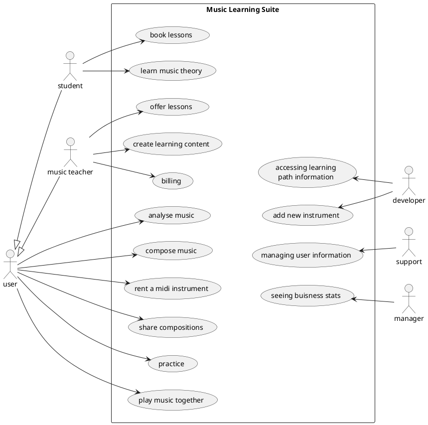
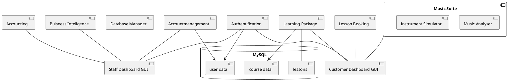
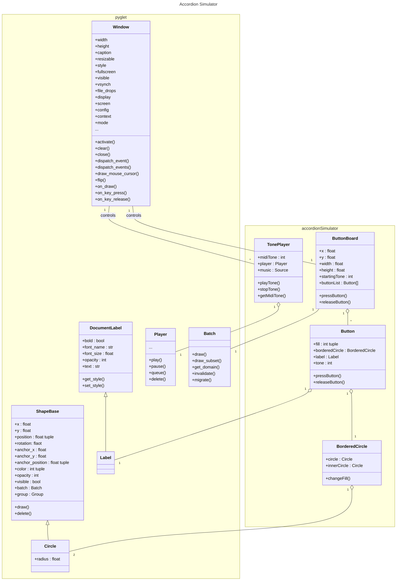
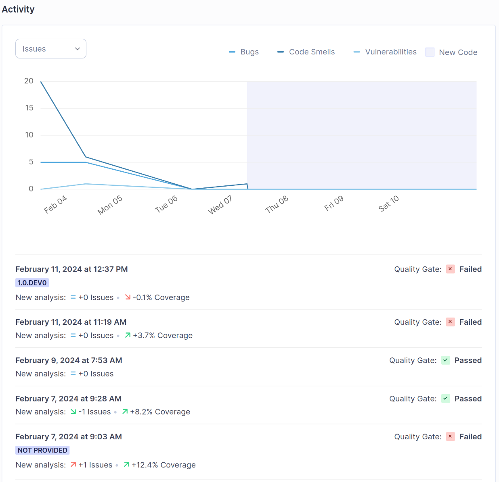
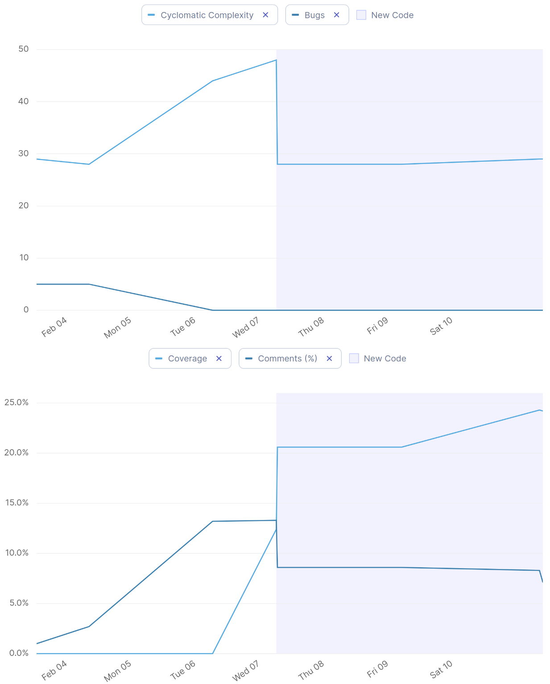
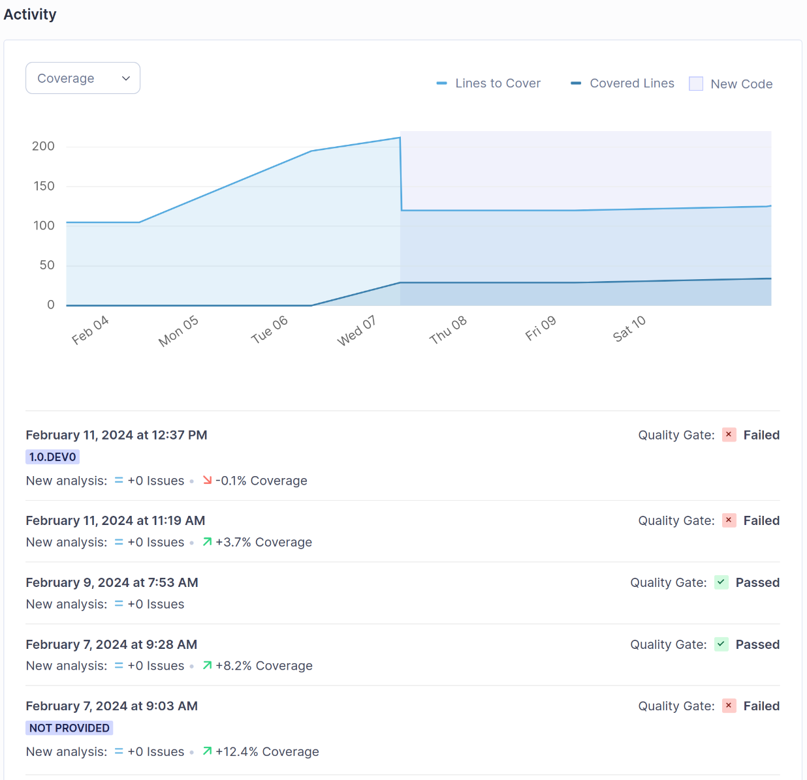

# Music Suite

## Links to the sections to assess

1. [Git](#git)
2. [UML](#uml-diagrams)
3. [DDD](#ddd)
4. [Metrics](#metrics)
5. [Clean Code Developement](#clean-code-developement)
6. [Build](#build)
7. [Continuous Delivery](#continuous-delivery)
8. [Unit tests](#unit-tests)
9. [IDE](#visual-studio-code)
10. [DSL](#dsl)
11. [Functional Programming](#functinal-programming)

## Pet project

### Setting up the environment and about programming language choice

In the task it is recommended to use Python as a programming language since it is important for the data scientists. Since I'm most fluently with R and JS right now I try to bridge Python code (to learn something new) with JS to use my skills in GUI design.

Pyglet seems to be a proper framework to catch multiple key presses and play multiple sounds at once so it might be useful for the live music app part of this project. But can it be integrated in the browsers view port? I will try Pyodide for this.

It might be better to not use a JS-Python bridge for easyness. Maybe this is just a architectural burden. The data processing and visualisation part might be low in this project and so data science related Python benefits might be not used at all.

In the end I decided to go with the pyglet framework for the accordion simulator and don't use Pyodide for building the online dashboard structure because the accordion simulator might become handy for my hobby.

For the tasks about **Build** and **Continuous Delivery** writing in C or C++ might have been interesting as well. But there I realy have super low experiecne. Java would be good thee too. But to be honest I like that Python, R, JS are not so cumbersome about types.

But I have to admit that I haven't worked on realy big projects and most of the time without object orientation. In the *Programmierung II* module from *Medieninformatik* study program here at BHT I started to get a glimpse on how Java can be benefitial for (larger) object oriented projects (like creating a sheduler app or music database).

### Accordion Simulator

Right now you can press buttons on your computer keyboard which are mapped to the buttons of an button accordion with b-grip. The correct tone - sampled from a VST instrument - will get played while a button is pressed.

Things to add:

* display which notes are played on the staff
* show how the accord is named that is played when pressing multiple buttons
* import a music sheet and 
    * play it
    * color the button that should be pressed right now (help to learning play)

It would be aesome if there could be something like in Guitar Hero where notes move toward a play area and have to be pressed at the right time.

## The big idea

With the Music Suite one should be able to find music teacher, find learning material, rent MIDI instruments and practice online as one would in the same room. Also one could play as a band together. Especially useful for less common instruments (like Great Highland Bagpipe or button accordion) and in far-distance-travel nations (like USA) where a possible teacher might be hours of car driving away.

A direct competitor would be [Yousician](https://yousician.com/) from whom I just found an Black Friday offer in my mailbox. But I think they just support MIDI instruments for piano till now and have no real one-to-one music teacher placement service. A better stand alone [accordion app](https://play.google.com/store/apps/details?id=com.egert.buttonaccordion&pli=1) can be found in the playstore already.

Another interesting feature shows the [moises app](https://moises.ai/de/). It claims being able to record music and to show when to play which chord. I tried it with the theme of *Der Pate* and it did not work correctly mixing up if a chord is Dur or mol. For some songs it can seperate the different instruments. An extension would be not only getting the chords but the whole sheet music.

### Buisness model

The core idea is to create a platform where people can learn to play an instrument. The music suite should provide possibilites to support the learning on your own and the learning phases between the lessons with a real music teacher. It is the core software product (for managing and creating learning courses we probably can adjust a ready learn content management system).

People can suscribe for different plans. A cheaper **learning on your own** version where you get access to the music suite and self study learning material. But there are also add on plans like **music lessons** with real teachers and maybe **band sessions** for excessive online meet-up times. So the core bussiness model ides is **subscription**.

Alternative bussinessmodels might be: 
* **freemium**: get some music time for free, maybe even extend the free time with sharing content on social media or by achieving goals
* **rent instead of buy**: rent the MIDI instrument and get the music suite for free
* **razor and blade**: sell the MIDI instrument pretty cheap but require the music suite subscription to use it

To increase their engagement with the platform it should be free to share your progression, compositions and sound samples with other people. Inside and outside the platform (since we might attract new customers this way).

Later one we want ot **leverage customer data** to create better self learning material to attract more customers and reduce dependency from music teachers.

Also part of our bussiness are:
* **virtualisation**: getting paid for the possibility for high quality music lessons for rare instruments due to MIDI instruments instead of homebrew camera / mic set-ups
* **affiliation**: music teachers can promote their lessons on our platform and reach more students

### UML diagrams

UML diagrams are used to communicate among programmers (and with managers). There are a lot of different types and they have all a bunch of details one probably don't memorises if one doesn't use it frequently. You pretty sure have to explain the diagram to the manager again and again but maybe he can keep track in complex systems.

For people who are used to UML diagrams it pretty sure is a more efficient way to check if one has common understanding about a problem than using text or speech. Programmers can orientate their work with those diagrams and e.g. check which interfaces / APIs a module should implement / provide.

I started to create the UML diagrams with Mermaid because I have heared of it in a web development context as it uses JS at a Moodle Stack conference. But since it does not support a wide range of diagram types I used plantuml later which you have shown us. Right now I use the public server for rendering the diagrams but coming to the end of this semester I could easily set up a [docker container](https://hub.docker.com/r/plantuml/plantuml-server/) for this as well.

This use case diagram shows the whole music suite. The accordion simulator should be one of many simulators and should be used to

* practice
* play music together
* compose music
* analyse music



Beside the simulator a LMS would be handy to organize learning material by music teachers. Also a backend dashboard for accounting, business insights etc. is needed. Everything might be accessed by a unified dashboard where you have to log in first before accessing the services your role grants you access to or start a instrument simulator. A first draft is shown in this component diagram:



In the class diagram you find the classes of the accordion simulator and the used classes from pyglet and their depenencies:



### DDD

It was difficult for me to distinguish sharply between a component UML diagram and the DDD-mapping. They still feel somewhat similar to me. A point where they differ is the question where the database for the LMS is placed (physically) and which team is responsible for it. Probably it will be in the same place as the other databases but there probably is a special team for the LMS database and one more general for managing the user information and accounting stuff.

<!-- thumbnail image wrapped in a link -->
<div id="eventstorming_original" style="width: 100%; max-width: 800px; margin: auto;">
    <a href="#eventstorming">
    
    </a>
    <i>click for fullscreen image</i>
</div>

<!-- lightbox container hidden with CSS -->
<a href="#eventstorming_original" class="lightbox" id="eventstorming">
  <span style="background-image: url('./docs/miro_images/Event Storming - Event Storming.jpg')"></span>
</a>

<!-- thumbnail image wrapped in a link -->
<div id="coredomainchart_original" style="width: 100%; max-width: 800px; margin: auto;">
    <a href="#coredomainchart">
    
    </a>
    <i>click for fullscreen image</i>
</div>

<!-- lightbox container hidden with CSS -->
<a href="#coredomainchart_original" class="lightbox" id="coredomainchart">
  <span style="background-image: url('./docs/miro_images/Event Storming - Core Domain Chart.jpg')"></span>
</a>

Please find my [DDD process documentation on Miro](https://miro.com/app/board/uXjVNS_z_ZA=/?share_link_id=232588702866).

## Coding

### Visual Studio Code

I also installed the SinoarCubeLint plugin to connect the Sonar Cube Server and Visual Studi Code.

#### Shortcuts

1. Ctrl+Shift+P: Execute stuff (e.g. like saving HTML version of Markdown)
2. Ctrl+B: Toggle side bar OR **fat text in .md**
3. Ctrl+Shift+F: Search all documents
4. Ctrl+Shift+G: Source Control
5. Ctrl+Shift+E: File view
6. Ctrl+P: find a file and open it
7. Ctrl+Shift+7: comment line (on other languages easily Ctrl+/)
8. Ctrl+Shift+A: block comment
9. Shift+F12: find occurancies of variable
10. F12: go to variable definition
11. F2: rename variable everywhere in scope
12. Alt+Up/Down: swap lines
13. Alt+Shift+Up/Down: create copy of line above / below

### Metrics

I pulled a docker image of sonar cube and run it. From the first round it told me to:

* rename my variables to meet a given naming convention. Instead of camel case it suggested snake case. 
* to add some accessibility code lines in the HTML files (also in the one which gets auto generated by Visual Studio Code from the markdown file).

At this moment (first run of SonarCube) there is no testcoverage at all. But there were also few bugs and vulnerabilities. Continuous usage of SonarQube helped reductin code smells fast and keeping those down.

<!-- thumbnail image wrapped in a link -->
<div id="issues_original" style="width: 100%; max-width: 800px; margin: auto;">
    <a href="#issues">
    
    </a>
    <i>click for fullscreen image</i>
</div>

<!-- lightbox container hidden with CSS -->
<a href="#issues_original" class="lightbox" id="issues">
  <span style="background-image: url('./docs/sonarqube_images/issues.png')"></span>
</a>

I included SonarQube into my PyBuilder pipeline. To get the same results from PyBuilder and a manual sonar-scanner I needed to specify the path to the sources to check in the `sonar-project.properties` file by adding `sonar.sources=src/main/python/`. Thus I don't get bothered with the messages on the auto generated HTML code anymore. The vertical drop in complexity and jump in coverage resulted in specifing which documents to check and which not.

<!-- thumbnail image wrapped in a link -->
<div id="metrics_original" style="width: 100%; max-width: 800px; margin: auto;">
    <a href="#metrics">
    
    </a>
    <i>click for fullscreen image</i>
</div>

<!-- lightbox container hidden with CSS -->
<a href="#metrics_original" class="lightbox" id="metrics">
  <span style="background-image: url('./docs/sonarqube_images/four_metrics.png')"></span>
</a>

### Git

Git is a system for version control you can use to keep track of your code changes and undo non-working changes. It can be used in a team to collaborate and team mates can work on different code sections in different branches until they got their stuff working and ready to merge it into the main branch.

I knew git before but almost all the time used it with *GitHub Desktop*. I had a look in command line git commands becaue of this module and *Computer Science for Big Data*. But I just rarely use those. But nowadays I use the git functionality directly from IDEs like Visual Studio Code and RStudio.

Until now I still miss a team project where I get used to working with git in a team efficiently. In *Machine Learning 2* I set up a git project but we never used branches but told each other when we are working on the project. Had some minor diffeences to merge though.

When I wanted to upload our work I was faced with the problem that the archive was 1 GB but we only saw 50 MB. It took until last weeks lecture in *Computer Science for Big Data* that we learned how git works in the background (not how to use it). I always thought it saves only changes. But it changes new copies of the whole file every time. NOW I understand why it could be interesting to use something else to versionise data instead of git. I didn't get the point before at all.

In *Data Science Platforms* we used a git system inside Dataiku but here one can't handle differences. It just overwrotes all changes from the other one. At least one could see in the history what was overwritten.

Most often the rename command is used on the terminal:
```
git mv OLD-FILENAME NEW-FILENAME
```

### Clean Code Developement

Clean code is important because not only computers have to be able to interpret code - but so do humans. This might be you in near or far future or a team member. Therefore, one should follow some clean code guidelines.

Using Python you are forced to use helpful intendation. I think this is one of the easiest points to follow. Thus it is not possible to write things like (dummy code for bad practice one might find possible in JS and so on):

```python
# bad
def test(x):
if (x > 3):
for i in range(x):
print(x*x)
return (True)
else:
print("Mühe lohnt nicht.")
return(False)
def test2(y):
return(y+2)

# better
def test(x):
  if (x > 3):
    for i in range(x):
      print(x*x)
    return (True)
  else:
    print("Mühe lohnt nicht.")
    return(False)
def test2(y):
  return(y+2)
```

In my opinion it is harder to build a common grounding at the question where one should use a spare line or not. I like to group comments with this technique. But I often come back later and rearrange the groupings. I'm not very consistent there - not even with my self. To continue the previous example there should be a spare line between the two `def`s. (Following *PEP8* there even should be two after class definitions.) If the spare line after the for loop helps to see where the return statement is placed is not clear to me.

```python
# even better
def test(x):
  if (x > 3):
    for i in range(x):
      print(x*x)
    return (True)
  else:
    print("Mühe lohnt nicht.")
    return(False)

def test2(y):
  return(y+2)

# or aybe with an additional line break after the for loop?
def test(x):
  if (x > 3):
    for i in range(x):
      print(x*x)

    return (True)
  else:
    print("Mühe lohnt nicht.")
    return(False)
    
def test2(y):
  return(y+2)
```

A realy important topic is: using names for varaibles and function that make clear what they do or what information/data they hold. This should be done in a manner that most of your comments become unneccasary. One example where I decided to rename a variable was changing **batch** to **accordionBatch** because it is used to group all shapes of the accordion only. Thus we are able to add another batch for the presenataion of staff and music tones in another area and easily could implement a function to toggle the visibility of those groups or rearrange their positions. Example:

```python
# bad
batch = pyglet.graphics.Batch() # batch to pass to the ButtonBoard constructor to hold all shapes for the accordion there
batch2 = pyglet.graphics.Batch() # batch to pass to the Staff constructor to hold all shapes for the staff there

# better
accordion_batch = pyglet.graphics.Batch()
staff_batch = pyglet.graphics.Batch()
```

Another place where I like to use not so clear variables isin loops. For simple integer variables I like to use `i`, `j`, `k`. But then it comes to an end and `i` and `j` look somewhat similar. And I used `s` for a string iterator. Lets fix this right now:

```python
# bad
for i in range(3,7): # scale covers tones from octave 3 to 7
  for s in [s + str(i) for s in scale]:
      big_scale.append(s)

# better
for octave_index in range(3,7): # scale covers tones from octave 3 to 7
  for note_and_octave in [note_and_octave + str(octave_index) for note_and_octave in scale]:
    big_scale.append(note_and_octave)
```

Also one should choose and stick a single style of variable casing. I tend to mix camel and snake case. E.g. at the moment of writing this passage I used a lot of camel case which SonarCube is complaining as code smell because in Python snake case is more common. And I used snake case at two places: e.g. `on_key_press()`. I find snake case easier to read but harder to write. But since one should focus on the people reading your code I will convert everything to snake case for everything but class names now. Following [PEP8](https://realpython.com/python-pep8/) I also added a second line break after class definitions.

It is also helping a lot to create intermediate variables instead of using a long command. E.g.:

```python
# bad
key_symbol_string = key.symbol_string(list(keymapping.keys())[list(keymapping.values()).index(i+self.starting_tone)])

# better
keys = list(keymapping.keys())
values = list(keymapping.values())
position = values.index(i+self.starting_tone) # get the position of the value that equals the tone
key_symbol_string = key.symbol_string(keys[position])
```

Futhermore don't use magic numbers:

```python
# bad:
window = pyglet.window.Window(960, 540)

# better:
window_width = 960
window_height = 540
window = pyglet.window.Window(window_width, window_height)

# bad
position = values.index(i+53) # get the position of the value that equals the tone

# better
self.starting_tone = 53
position = values.index(i+self.starting_tone) # get the position of the value that equals the tone
```

At least I want to mention the possibility to give more meaningful error messsages. It might be better to get `FileNotFoundError: The wav file for midi tone number 54 is missing. It should be placed at: ./src/main/data/wav/Accordion 054.wav` instead of the standard message `FileNotFoundError: [Errno 2] No such file or directory: './src/main/data/wav/Accordion 054.wav'`. You can do this by testing for possible sources of errors (see below) or use a try-except-block.

```python
# bad
class TonePlayer:
    def __init__(self, midi_tone):
        self.midi_tone = midi_tone
        self.player = pyglet.media.Player()
        path_to_file = "./src/main/data/wav/Accordion 0"+str(self.midi_tone)+".wav"
        self.music = pyglet.media.load(path_to_file, streaming=False)

# better
class TonePlayer:
    def __init__(self, midi_tone):
        self.midi_tone = midi_tone
        self.player = pyglet.media.Player()
        path_to_file = "./src/main/data/wav/Accordion 0"+str(self.midi_tone)+".wav"
        wav_exists = exists(path_to_file)
        if wav_exists:
            self.music = pyglet.media.load(path_to_file, streaming=False)
        else:
            raise FileNotFoundError(f"The wav file for midi tone number {self.midi_tone} is missing.\nIt should be placed at: {path_to_file}")

# alternative
class TonePlayer:
    def __init__(self, midi_tone):
        self.midi_tone = midi_tone
        self.player = pyglet.media.Player()
        path_to_file = "./src/main/data/wav/Accordion 0"+str(self.midi_tone)+".wav"
        try:
            self.music = pyglet.media.load(path_to_file, streaming=False)
        except FileNotFoundError:
            raise FileNotFoundError(f"The wav file for midi tone number {self.midi_tone} is missing.\nIt should be placed at: {path_to_file}")
```

I just fixed all PEP8 issues that flake8 stated and limited the line width to 79 (suggested in PEP8; warning in flake8 for lines longer than 120 characters). I'm not sure if I prefer the resultung line breaks to the longer lines.I ended up adding new blank lines for definitions where I introduced line breaks:

```python
# before
if tone % 3 == 2:
  button1 = Button(tone, label, self.x+x_offset+((tone-self.starting_tone)//3-1/3)*x_shift, self.y-3*y_shift, radius, borderwidth, color, fill, batch)
  button2 = Button(tone, label, self.x+x_offset+((tone-self.starting_tone)//3-1/3)*x_shift, self.y-0*y_shift, radius, borderwidth, color, fill, batch)
  self.button_list.append((button1, button2))

# after
if tone % 3 == 2:
  button1 = Button(
    tone, label, self.x+x_offset
    + ((tone-self.starting_tone)//3-1/3)*x_shift,
    self.y-3*y_shift, radius, borderwidth, color, fill, batch
    )

  button2 = Button(
    tone, label, self.x+x_offset
    + ((tone-self.starting_tone)//3-1/3)*x_shift,
    self.y-0*y_shift, radius, borderwidth, color, fill, batch
    )
  
  self.button_list.append((button1, button2))
```

#### Clean Code Cheat Sheet

* decide to use either camel or snake case for each type (class, variable, function, ...)
* use clear naming
  * verbs for functions
  * nouns for variables
  * especially in for loops
* use indentation
* use spare lines to group code on the same indentation level
* use intermediate variables instead of very nested structures (and comment them if necessary)
* give meaningful eror messages by handling those explicitly

### Build

A build tool is used to create executabl code from the ource code. Furthermore one can include tests and more in the pipeline. Even though Python code does not to be compiled to execute it one could use a build tool e.g. to create a executable file for usage without Pyton environment or an installer.

The things done with a build tool might be a subset of the tasks done in the CI/CD pipeline. But most often some more advanced tests like integration tests are done mainly in the CI/CD pipeline in a common system to check all developers code against.

As a build tool I used PyBuilder to run unit tests and lint tests (flake8). For the unit tests I started with the core `unittest` module. Later I set PyBuilder up to use `pytest` as testing framework. Because I was new to PyBuilder and not every experiences to pytest it took me some time to find possible sources of problems. In the end it was enough to change the testfile name as commented on [GitHub](https://github.com/AlexeySanko/pybuilder_pytest/issues/24). Since pytest can also run tests written for the core testframework I ended up with a file of the naming convention pattern `test_*_tests.py` for test purpurses. `test_*.py` is used by pytest and `*_tests.py` is the default for the core framework in PyBuilder. For production I'ld suggest renaming it to the pattern `test_*.py` if one uses pytest. With both setups you get a report like this:

```bash
PyBuilder version 0.13.10
Build started at 2024-02-11 11:43:52
------------------------------------------------------------
[INFO]  Building Music-Suite version 1.0.dev0
[INFO]  Executing build in /home/simon/Dokumente/data_science/1st_semester/software_engineering/Music-Suite
[INFO]  Going to execute task publish
[INFO]  Processing plugin packages 'coverage>=6.0' to be installed with {'upgrade': True}
[INFO]  Processing plugin packages 'flake8>=4.0' to be installed with {'upgrade': True}
[INFO]  Processing plugin packages 'pypandoc~=1.4' to be installed with {'upgrade': True}
[INFO]  Processing plugin packages 'setuptools>=38.6.0' to be installed with {}
[INFO]  Processing plugin packages 'twine>=1.15.0' to be installed with {'upgrade': True}
[INFO]  Processing plugin packages 'unittest-xml-reporting>=3.0.4' to be installed with {'upgrade': True}
[INFO]  Processing plugin packages 'wheel>=0.34.0' to be installed with {}
[INFO]  Creating target 'build' VEnv in '/home/simon/Dokumente/data_science/1st_semester/software_engineering/Music-Suite/target/venv/build/cpython-3.10.12.final.0'
[INFO]  Creating target 'test' VEnv in '/home/simon/Dokumente/data_science/1st_semester/software_engineering/Music-Suite/target/venv/test/cpython-3.10.12.final.0'
[INFO]  Requested coverage for tasks: pybuilder.plugins.python.unittest_plugin:run_unit_tests
[INFO]  Running unit tests
[INFO]  Executing unit tests from Python modules in /home/simon/Dokumente/data_science/1st_semester/software_engineering/Music-Suite/src/unittest/python
[INFO]  Executed 4 unit tests
[INFO]  All unit tests passed.
[INFO]  Building distribution in /home/simon/Dokumente/data_science/1st_semester/software_engineering/Music-Suite/target/dist/Music-Suite-1.0.dev0
[INFO]  Copying scripts to /home/simon/Dokumente/data_science/1st_semester/software_engineering/Music-Suite/target/dist/Music-Suite-1.0.dev0/scripts
[INFO]  Writing setup.py as /home/simon/Dokumente/data_science/1st_semester/software_engineering/Music-Suite/target/dist/Music-Suite-1.0.dev0/setup.py
[INFO]  Collecting coverage information for 'pybuilder.plugins.python.unittest_plugin:run_unit_tests'
[WARN]  ut_coverage_branch_threshold_warn is 0 and branch coverage will not be checked
[WARN]  ut_coverage_branch_partial_threshold_warn is 0 and partial branch coverage will not be checked
[INFO]  Running unit tests
[INFO]  Executing unit tests from Python modules in /home/simon/Dokumente/data_science/1st_semester/software_engineering/Music-Suite/src/unittest/python
[INFO]  Executed 4 unit tests
[INFO]  All unit tests passed.
[WARN]  Test coverage below 70% for accordion: 36%
[WARN]  Test coverage below 70% for instrument_simulator:  0%
[WARN]  Overall pybuilder.plugins.python.unittest_plugin.run_unit_tests coverage is below 70%: 26%
[INFO]  Overall pybuilder.plugins.python.unittest_plugin.run_unit_tests branch coverage is  6%
[INFO]  Overall pybuilder.plugins.python.unittest_plugin.run_unit_tests partial branch coverage is 100%
[WARN]  Test coverage below 70% for accordion: 36%
[WARN]  Test coverage below 70% for instrument_simulator:  0%
[WARN]  Overall Music-Suite coverage is below 70%: 26%
[INFO]  Overall Music-Suite branch coverage is  6%
[INFO]  Overall Music-Suite partial branch coverage is 100%
------------------------------------------------------------
BUILD FAILED - Test coverage for at least one module is below 70% (pybuilder/plugins/python/coverage_plugin.py:157)
------------------------------------------------------------
Build finished at 2024-02-11 11:43:55
Build took 3 seconds (3277 ms)
```

With the standard test framework the test results are stored in a seperate .xml every time tests ran. The results are not shown in the console. This is different with pytest. Here the test results are printed in the console which makes it faster to investigated what failed. On the other hand you have to configure the `build.py` in order to get a .xml report (that is used to communicate with SonarQube). This file gets overwritten each time. You might end up storing multiple copies when you are versioning the file with git anyway.

```bash
PyBuilder version 0.13.10
Build started at 2024-02-11 11:18:08
------------------------------------------------------------
[INFO]  Installing or updating plugin "pypi:pybuilder_pytest, module name 'pybuilder_pytest'"
[INFO]  Installing or updating plugin "pypi:pybuilder_pytest_coverage, module name 'pybuilder_pytest_coverage'"
[INFO]  Processing plugin packages 'pybuilder_pytest' to be installed with {}
[INFO]  Processing plugin packages 'pybuilder_pytest_coverage' to be installed with {}
[INFO]  Building Music-Suite version 1.0.dev0
[INFO]  Executing build in /home/simon/Dokumente/data_science/1st_semester/software_engineering/Music-Suite
[INFO]  Going to execute task publish
[INFO]  Processing plugin packages 'flake8>=4.0' to be installed with {'upgrade': True}
[INFO]  Processing plugin packages 'pypandoc~=1.4' to be installed with {'upgrade': True}
[INFO]  Processing plugin packages 'setuptools>=38.6.0' to be installed with {}
[INFO]  Processing plugin packages 'twine>=1.15.0' to be installed with {'upgrade': True}
[INFO]  Processing plugin packages 'wheel>=0.34.0' to be installed with {}
[INFO]  Creating target 'build' VEnv in '/home/simon/Dokumente/data_science/1st_semester/software_engineering/Music-Suite/target/venv/build/cpython-3.10.12.final.0'
[INFO]  Creating target 'test' VEnv in '/home/simon/Dokumente/data_science/1st_semester/software_engineering/Music-Suite/target/venv/test/cpython-3.10.12.final.0'
[INFO]  pytest: Run unittests.
==================================================================================================================================================== test session starts =====================================================================================================================================================
platform linux -- Python 3.10.12, pytest-8.0.0, pluggy-1.4.0
rootdir: /home/simon/Dokumente/data_science/1st_semester/software_engineering/Music-Suite
plugins: cov-4.1.0
collected 4 items                                                                                                                                                                                                                                                                                                            

src/unittest/python/test_accordion_tests.py ....                                                                                                                                                                                                                                                                       [100%]/home/simon/Dokumente/data_science/1st_semester/software_engineering/Music-Suite/.pybuilder/plugins/cpython-3.10.12.final.0/lib/python3.10/site-packages/coverage/inorout.py:503: CoverageWarning: Module instrument_simulator was never imported. (module-not-imported)
  self.warn(f"Module {pkg} was never imported.", slug="module-not-imported")


---------- coverage: platform linux, python 3.10.12-final-0 ----------
Name                           Stmts   Miss Branch BrPart  Cover   Missing
--------------------------------------------------------------------------
src/main/python/accordion.py      92     58     23      0    31%   9-12, 15, 20-29, 32, 35, 40-89, 92-93, 96-97, 167
--------------------------------------------------------------------------
TOTAL                             92     58     23      0    31%
Coverage XML written to file /home/simon/Dokumente/data_science/1st_semester/software_engineering/Music-Suite/target/reports/pytest_coverage.xml

FAIL Required test coverage of 70% not reached. Total coverage: 31.30%

===================================================================================================================================================== 4 passed in 0.30s ======================================================================================================================================================
------------------------------------------------------------
BUILD FAILED - pytest: unittests failed (pybuilder_pytest/__init__.py:52)
------------------------------------------------------------
Build finished at 2024-02-11 11:18:11
Build took 2 seconds (2972 ms)
```

After some trouble I was able to link PyBuilder with my local Docker image of SonarQube. I posted an explanation on how to do this on [GitHub](https://github.com/pybuilder/pybuilder/issues/902#issuecomment-1931589831) because there already have been some open issue tickets on this question. The documentation could need another tutorial about this topic for flawless setup for beginners.

### Continuous Delivery

Setting up a CI/CD pipeling is important to reduce the cycle time. This is important to enable small and fast fixes / adjustments / addons for software while minimising the thread of introducing new errors since all the code is tested continuously when checked in. Thus, if there is no error reported (and the testcases are exhaustive) one could use the new code. It also can automate and document (make visible for everyone) a lot of prepparation and cleanup processes.

As stated before the actions in a CI/CD pipeline might include all actions in the locally executed build pipeline. This is important to asure noone checks in locally untested code that would have errors e.g. in the unit tests. Within a CI/CD pipeline it is possible to run all tests again but on various OS and with various framework versions.

Please find the [GitHub action file](https://github.com/Famondir/Music-Suite/blob/main/.github/workflows/test_and_lint.yml) in my GitHub repository.

I was unsure if I should set up a local Jenkins server to keep everything local ot if I should use GitHub actions. In a productional environment both would not run on your local computer but central so all team members check against the same system. Finally I decided to use GitHub actions because the code should be in a GitHub repository for the hand in anyway. Also there was a GitHub action pattern for [PyBuilder](https://github.com/marketplace/actions/pybuilder-action).

Instead of trying to use the PyBuilder GitHub action I ended up with manually setting up a testing and a linting action. I seperated those two because the linting result is the same on each OS. But my unit tests should run on Windows and Linux as well as for multiple Python versions. For the unittests `xvfb` is needed because pyglet requires a display. Unfortunately xvfb is not working on Windows machines - thus I could not test my program there easily. Using the GitHub action [setup-xvfb](https://github.com/coactions/setup-xvfb) did not the trick.

During the testing I got a lot of mails informing me that there have been some errors while performing the defined actions. Good for a productive setting. A little bit annoying here. The VS Code plugin is handy but would be better if one can see the partial logs locally not only the whole log (for partial logs you have to go to GitHub; though the link is provided as a button). The related [GitHub issue](https://github.com/github/vscode-github-actions/issues/15) was closed.

### Unit tests

* How to test functions like playing a note. Testing playing attribute or returning informative string? 
* What about other functions with side effects? Mock package to get print messages?

Tasks that have not be accomplished now:
* Pytest unittests for pyglet

<!-- thumbnail image wrapped in a link -->
<div id="coverage_original" style="width: 100%; max-width: 800px; margin: auto;">
    <a href="#coverage">
    
    </a>
    <i>click for fullscreen image</i>
</div>

<!-- lightbox container hidden with CSS -->
<a href="#coverage_original" class="lightbox" id="coverage">
  <span style="background-image: url('./docs/sonarqube_images/coverage.png')"></span>
</a>

### DSL

### Functional Programming

# Programming issues

* mapping of keyboard keys on linux and windows different (and also for different layouts / languages) => one would need a option to adjust the mapping in the settings / in an external file
* text on buttons should be property of button as it's color should be to chang it on button press as well as the background color

<style>
/** LIGHTBOX MARKUP **/
/* source: https://codepen.io/gschier/pen/kyRXVx */

.lightbox {
  /* Default to hidden */
  display: none;

  /* Overlay entire screen */
  position: fixed;
  z-index: 999;
  top: 0;
  left: 0;
  right: 0;
  bottom: 0;
  
  /* A bit of padding around image */
  padding: 1em;

  /* Translucent background */
  background: rgba(0, 0, 0, 0.8);
}

/* Unhide the lightbox when it's the target */
.lightbox:target {
  display: block;
}

.lightbox span {
  /* Full width and height */
  display: block;
  width: 100%;
  height: 100%;

  /* Size and position background image */
  background-position: center;
  background-repeat: no-repeat;
  background-size: contain;
}
</style>