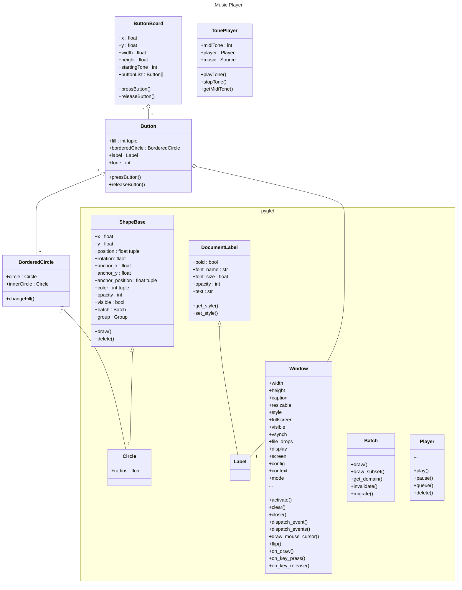

# Music Suite

## Process documentation

### Setting up the environment

In the task it is recommended to use Python as a programming language since it is important for the data scientists. Since I'm most fluently with R and JS right now I try to bridge Python code (to learn something new) with JS to use my skills in GUI design.

Pyglet seems to be a proper framework to catch multiple key presses and play multiple sounds at once so it might be useful for the live music app part of this project. But can it be integrated in the browsers view port? I will try Pyodide for this.

It might be better to not use a JS-Python bridge for easyness. Maybe this is just a architectural burden. The data processing and visualisation part might be low in this project and so Python benefits might be not used at all.

